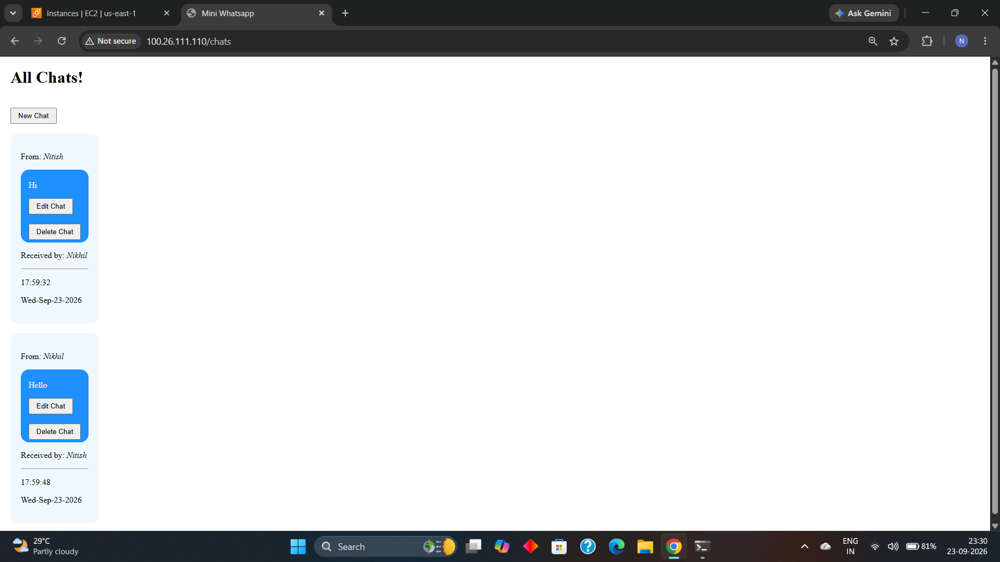
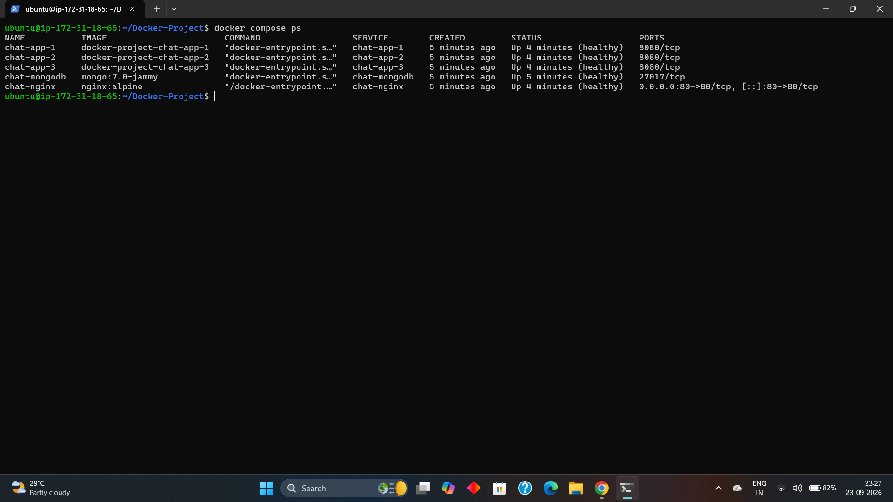
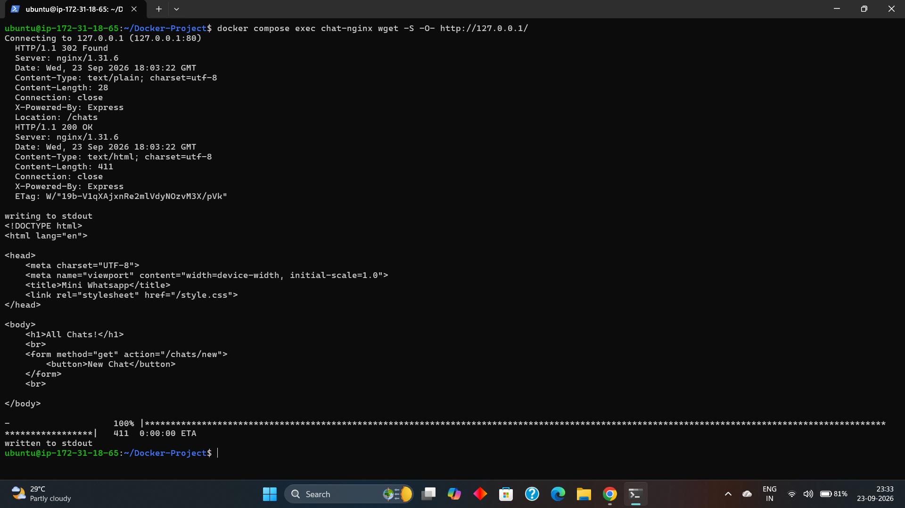
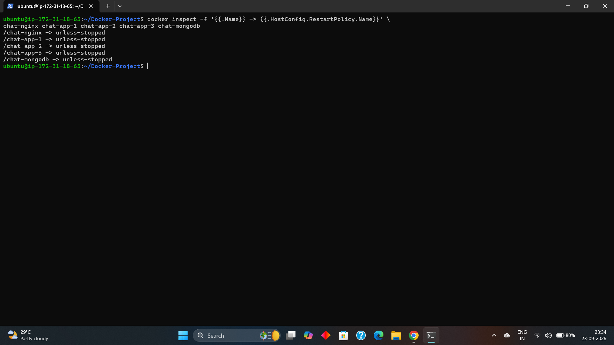

# Docker Three-Tier Chat Application

A hands-on Docker and DevOps learning project built around a **Node.js chat application that I developed myself while learning web development**.

After developing the application, I used it to learn Docker and DevOps concepts such as Docker Compose, container networking, Nginx reverse proxy and load balancing, MongoDB persistence, health checks, and restart policies.

## Architecture

```text
                         Internet
                            |
                            v
                    +---------------+
                    |   Nginx :80   |
                    | Reverse Proxy |
                    | Load Balancer  |
                    +-------+-------+
                            |
              +-------------+-------------+
              |             |             |
              v             v             v
        +-----------+ +-----------+ +-----------+
        | chat-app-1| | chat-app-2| | chat-app-3|
        | Node.js   | | Node.js   | | Node.js   |
        |   :8080   | |   :8080   | |   :8080   |
        +-----+-----+ +-----+-----+ +-----+-----+
              |             |             |
              +-------------+-------------+
                            |
                            v
                    +---------------+
                    |  chat-mongodb |
                    |    :27017     |
                    +-------+-------+
                            |
                            v
                  +-------------------+
                  | chat-mongodb-data |
                  |   Named Volume    |
                  +-------------------+
```

## Technologies

- Node.js
- Express.js
- EJS
- MongoDB
- Mongoose
- Docker
- Docker Compose
- Nginx
- AWS EC2

## Application Features

The chat application was developed by me while learning web development.

- Create chats
- View chats
- Edit chats
- Delete chats
- MongoDB database integration
- EJS views
- Express.js routes

## Docker & DevOps Features

- Custom Dockerfile for the Node.js application
- Docker Compose for multi-container deployment
- Three Node.js application containers
- Nginx reverse proxy and load balancing
- Custom Docker network
- MongoDB named volume for persistent data
- Health checks for Nginx, Node.js, and MongoDB
- `restart: unless-stopped` policies
- Environment-based MongoDB connection
- Deployed and tested on AWS EC2

## Project Structure

```text
Docker-Project/
├── .dockerignore
├── .gitignore
├── Dockerfile
├── docker-compose.yml
├── app/
│   ├── index.js
│   ├── init.js
│   ├── models/
│   │   └── chat.js
│   ├── package.json
│   ├── package-lock.json
│   ├── public/
│   │   └── style.css
│   └── views/
│       ├── edit.ejs
│       ├── index.ejs
│       └── new.ejs
└── nginx/
    └── nginx.conf
```

## Prerequisites

Make sure the following are installed:

- Docker
- Docker Compose
- Git

For AWS deployment:

- AWS EC2 instance
- Ubuntu Linux
- Port 80 open in the EC2 Security Group

## How to Run

### Clone the Repository

```bash
git clone https://github.com/Nitish-Borse/docker-three-tier-chat-app.git
cd docker-three-tier-chat-app
```

### Start the Application

```bash
docker compose up -d --build
```

### Check Services

```bash
docker compose ps
```

### Stop the Application

```bash
docker compose down
```

Open the application through Nginx:

```text
http://<EC2-PUBLIC-IP>
```

## Screenshots

### Chat Application



### Docker Compose Services



### Nginx Connectivity



### Restart Policies



## Learning Journey

I first developed this Node.js chat application while learning web development.

Later, while learning Docker and DevOps, I used my own application as a practical project to understand containerization, Docker Compose, Nginx, container networking, persistent storage, health checks, and restart policies.

This project helped me connect my application development knowledge with Docker and DevOps concepts.
