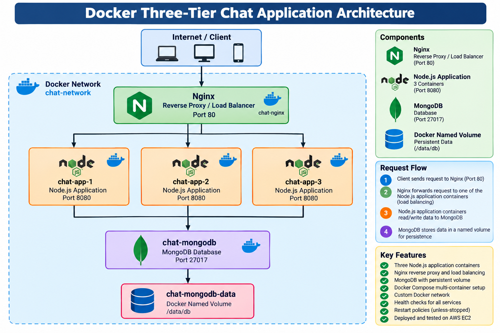
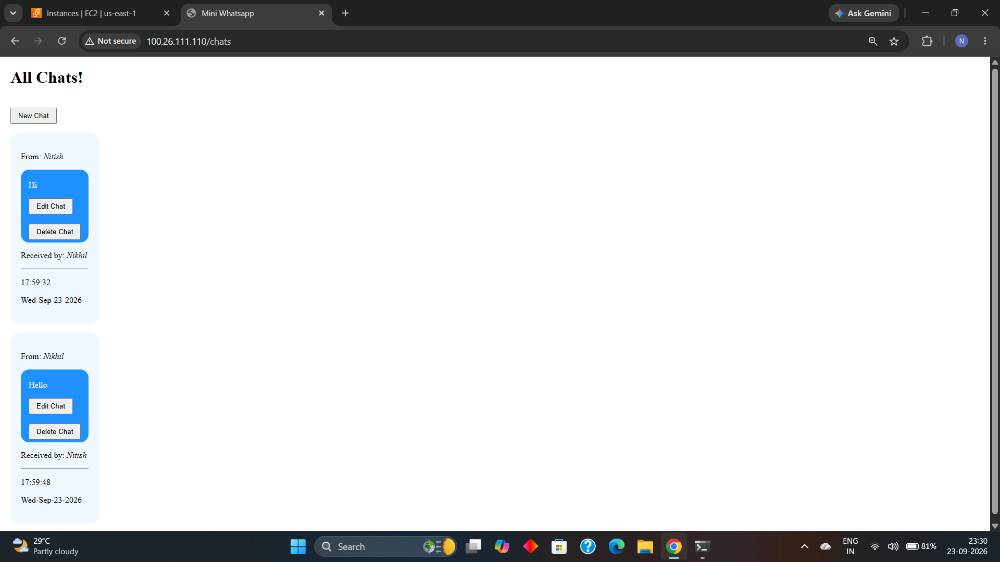
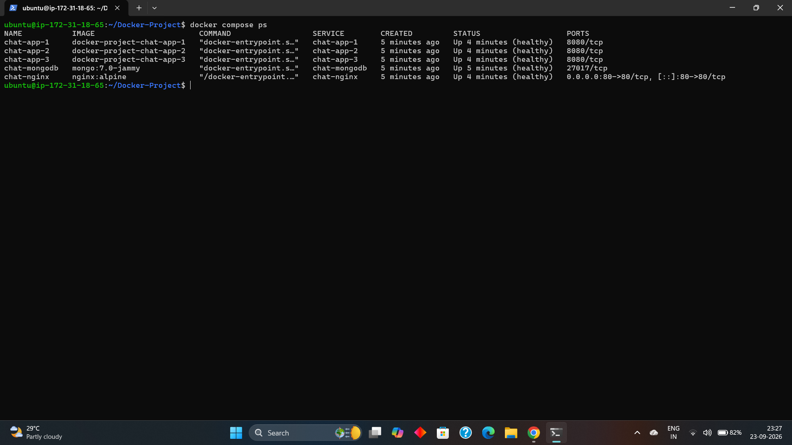
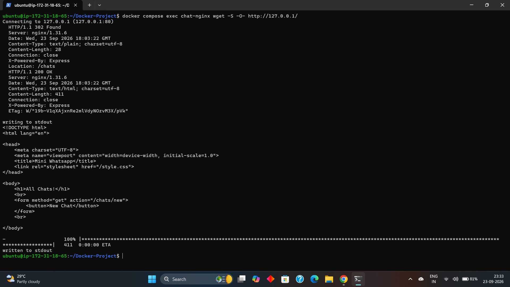
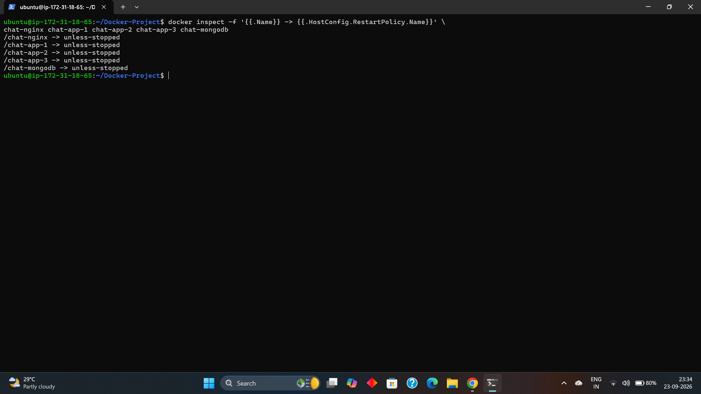

# Docker Three-Tier Chat Application

A hands-on Docker and DevOps learning project built around a Node.js chat application. The application was developed first while learning web development and was then containerized and deployed to learn Docker, Docker Compose, Nginx reverse proxy/load balancing, persistent storage, health checks, restart policies, and container networking.

## Architecture



### Architecture Flow

```text
Internet / Client
       |
       v
+----------------------+
|   Nginx :80          |
| Reverse Proxy        |
| Load Balancer        |
+----------+-----------+
           |
     +-----+-----+-----+
     |     |     |     |
     v     v     v     v
+--------+ +--------+ +--------+
| chat-app-1 | | chat-app-2 | | chat-app-3 |
| :8080  | | :8080  | | :8080  |
+----+---+ +----+---+ +----+---+
     |          |          |
     +----------+----------+
                |
                v
        +---------------+
        |   MongoDB     |
        |    :27017     |
        +-------+-------+
                |
                v
        +---------------+
        | Named Volume  |
        | /data/db      |
        +---------------+
```

All containers communicate through the custom Docker network `chat-network`.

## Request Flow

1. A client sends a request to Nginx on port `80`.
2. Nginx forwards the request to one of the three Node.js application containers.
3. The Node.js application reads from or writes data to MongoDB.
4. MongoDB stores its data in the Docker named volume `chat-mongodb-data`.
5. Health checks and restart policies help keep the services available.

## Technologies Used

- Node.js
- Express.js
- EJS
- MongoDB
- Mongoose
- Docker
- Docker Compose
- Nginx
- AWS EC2
- Ubuntu Linux
- Docker Hub

## Application Features

The original Node.js chat application provides:

- Create chats
- View chats
- Edit chats
- Delete chats
- MongoDB database integration
- EJS-based views
- Express.js routes

## Docker & DevOps Features

This project demonstrates:

- Custom Docker image using a `Dockerfile`
- Docker Compose multi-container setup
- Three Node.js application containers
- Nginx reverse proxy and load balancing
- MongoDB container
- Custom Docker bridge network
- Docker named volume for persistent MongoDB data
- Health checks for all services
- Restart policies using `unless-stopped`
- Environment-based MongoDB connection
- Dependency health conditions using `depends_on`
- Deployment and testing on AWS EC2
- Docker Hub image publishing

## Docker Hub Image

The application image is available on Docker Hub:

```text
nitishborse/chatapp-img:latest
```

Pull the image with:

```bash
docker pull nitishborse/chatapp-img:latest
```

The Docker Compose configuration in this repository builds the Node.js application image locally from the project `Dockerfile`. The Docker Hub image is provided separately for learning and image-publishing practice.

## Project Structure

```text
docker-three-tier-chat-app/
│
├── Dockerfile
├── docker-compose.yml
├── README.md
├── .dockerignore
├── .gitignore
│
├── app/
│   ├── index.js
│   ├── init.js
│   ├── package.json
│   ├── package-lock.json
│   ├── models/
│   │   └── chat.js
│   ├── public/
│   │   └── style.css
│   └── views/
│       ├── index.ejs
│       ├── new.ejs
│       └── edit.ejs
│
├── nginx/
│   └── nginx.conf
│
└── screenshots/
    ├── application.png
    ├── docker-architecture.png
    ├── docker-compose-ps.png
    ├── nginx-connectivity.png
    └── restart-policies.png
```

## Docker Compose Services

The project runs five containers:

| Container | Purpose | Port |
|---|---|---:|
| `chat-nginx` | Reverse proxy / load balancer | `80` |
| `chat-app-1` | Node.js application | `8080` |
| `chat-app-2` | Node.js application | `8080` |
| `chat-app-3` | Node.js application | `8080` |
| `chat-mongodb` | MongoDB database | `27017` |

The Node.js containers are not directly published to the host. Nginx receives external traffic on port `80` and forwards requests to the application containers.

## Prerequisites

- Ubuntu Linux or another Linux distribution
- Docker
- Docker Compose
- Git
- AWS EC2 instance if deploying remotely

Check Docker:

```bash
docker --version
```

Check Docker Compose:

```bash
docker compose version
```

## AWS EC2 Setup

The project was deployed and tested on an Ubuntu EC2 instance.

For access from the internet, allow TCP port `80` in the EC2 security group.

Example:

```text
Type: HTTP
Protocol: TCP
Port: 80
Source: 0.0.0.0/0
```

For better security, restrict access according to your actual deployment requirements.

## Clone the Repository

```bash
git clone https://github.com/Nitish-Borse/docker-three-tier-chat-app.git
cd docker-three-tier-chat-app
```

## Build and Start the Application

Build the Node.js image and start all services:

```bash
docker compose up -d --build
```

Check the running containers:

```bash
docker compose ps
```

Expected services:

```text
chat-nginx
chat-app-1
chat-app-2
chat-app-3
chat-mongodb
```

All services should eventually show:

```text
healthy
```

## Access the Application

Open the EC2 public IP in a browser:

```text
http://<EC2-PUBLIC-IP>/chats
```

The application can also be tested locally with:

```bash
curl -I http://localhost/chats
```

Expected response:

```text
HTTP/1.1 200 OK
```

## Verification

### Check Container Status

```bash
docker compose ps
```

All five services should be running and healthy.

### Check Application Logs

```bash
docker compose logs chat-app-1
```

You should see messages similar to:

```text
app is listening on port: 8080
connection successful
```

### Check Nginx Logs

```bash
docker compose logs chat-nginx
```

### Check MongoDB Logs

```bash
docker compose logs chat-mongodb
```

### Check Individual Health Status

```bash
docker inspect --format='{{.State.Health.Status}}' chat-nginx
docker inspect --format='{{.State.Health.Status}}' chat-app-1
docker inspect --format='{{.State.Health.Status}}' chat-app-2
docker inspect --format='{{.State.Health.Status}}' chat-app-3
docker inspect --format='{{.State.Health.Status}}' chat-mongodb
```

## Health Checks

Health checks are configured for all services.

Example application health check:

```yaml
healthcheck:
  test: ["CMD", "wget", "--spider", "-q", "http://localhost:8080/"]
  interval: 10s
  timeout: 5s
  retries: 3
  start_period: 20s
```

MongoDB uses a `mongosh` ping command to verify database availability.

Nginx uses an HTTP request against its local endpoint.

## Nginx Reverse Proxy and Load Balancing

Nginx acts as the entry point for the application.

The upstream configuration contains three Node.js containers:

```nginx
upstream chat_backend {
    server chat-app-1:8080;
    server chat-app-2:8080;
    server chat-app-3:8080;
}
```

Nginx forwards incoming requests to the available application containers.

This demonstrates basic load balancing with multiple application containers on the same Docker host.

## Docker Network

All application services use the custom Docker network:

```text
chat-network
```

The containers communicate using Docker service/container names instead of hard-coded container IP addresses.

For example, the Node.js containers connect to MongoDB using:

```text
mongodb://chat-mongodb:27017/whatsapp
```

This demonstrates Docker's internal DNS-based service discovery.

## Persistent Storage

MongoDB uses a named Docker volume:

```text
chat-mongodb-data
```

It is mounted inside the MongoDB container at:

```text
/data/db
```

This allows MongoDB data to persist when the MongoDB container is recreated.

List volumes:

```bash
docker volume ls
```

Inspect the project volume:

```bash
docker volume inspect docker-three-tier-chat-app_chat-mongodb-data
```

## Restart Policies

The services use:

```yaml
restart: unless-stopped
```

This allows Docker to automatically restart containers after failures or Docker daemon restarts, unless the container was intentionally stopped.

You can inspect a container's restart policy with:

```bash
docker inspect chat-app-1 --format='{{.HostConfig.RestartPolicy.Name}}'
```

## Docker Compose Dependency Conditions

The application containers depend on MongoDB being healthy:

```yaml
depends_on:
  chat-mongodb:
    condition: service_healthy
```

This helps prevent the application containers from starting before MongoDB passes its health check.

## Useful Docker Commands

Start the project:

```bash
docker compose up -d
```

Build and start:

```bash
docker compose up -d --build
```

Stop services:

```bash
docker compose down
```

Stop services and remove the named volume:

```bash
docker compose down -v
```

View running containers:

```bash
docker compose ps
```

View all project logs:

```bash
docker compose logs
```

Follow logs:

```bash
docker compose logs -f
```

Follow application logs:

```bash
docker compose logs -f chat-app-1
```

Restart a service:

```bash
docker compose restart chat-app-1
```

Open a shell inside a container:

```bash
docker exec -it chat-app-1 sh
```

## Troubleshooting

### Check Overall Service Status

```bash
docker compose ps
```

### Check Application Logs

```bash
docker compose logs chat-app-1
```

### Check Nginx Logs

```bash
docker compose logs chat-nginx
```

### Check MongoDB Logs

```bash
docker compose logs chat-mongodb
```

### Check Container Health

```bash
docker inspect --format='{{.State.Health.Status}}' <container-name>
```

### Rebuild After Application Changes

```bash
docker compose down
docker compose up -d --build
```

If MongoDB data is not required and you intentionally want to start with a clean database:

```bash
docker compose down -v
docker compose up -d --build
```

> `docker compose down -v` deletes the project's named volume and therefore removes the stored MongoDB data. Use it only when you intentionally want to reset the database.

## Screenshots

### Application



### Docker Compose Status



### Nginx Connectivity



### Restart Policies



### Architecture


## Learning Journey

This project was created as a practical learning project to understand how a web application can be containerized and operated using Docker.

The main concepts practiced were:

- Writing a Dockerfile
- Building Docker images
- Running containers
- Docker Compose
- Multi-container application architecture
- Docker networking
- Nginx reverse proxy
- Load balancing
- MongoDB containerization
- Persistent volumes
- Health checks
- Restart policies
- Service dependency conditions
- Environment variables
- Docker Hub image publishing
- Deployment and testing on AWS EC2
- Linux command-line troubleshooting

## Limitations

This project is intended for learning Docker and DevOps fundamentals rather than production deployment.

Current limitations include:

- MongoDB runs as a single container.
- MongoDB does not use a replica set.
- The named volume is local to the Docker host.
- There is no production-grade database backup or disaster recovery setup.
- Nginx and all application containers run on a single Docker host.
- Docker Compose is used instead of Kubernetes for orchestration.
- No production-grade monitoring or centralized logging is configured.

These limitations are intentional and keep the project focused on Docker fundamentals.

## Cleanup

Stop and remove the containers and network:

```bash
docker compose down
```

To also remove the MongoDB named volume:

```bash
docker compose down -v
```

To remove project images if required:

```bash
docker image ls
docker image rm <image-id>
```

## Author

**Nitish Borase**

GitHub: [Nitish-Borse](https://github.com/Nitish-Borse)
